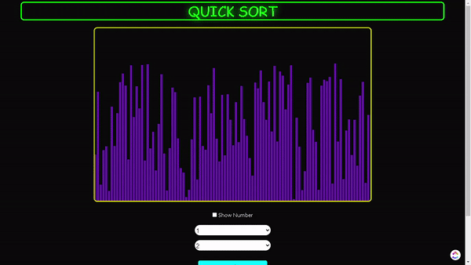
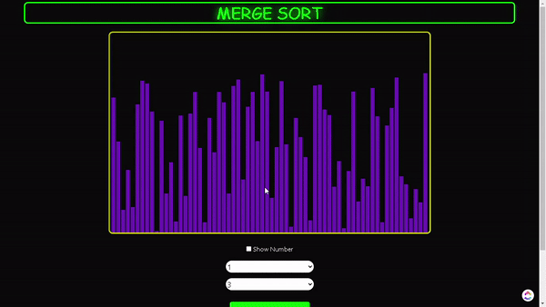

# SORTING ALGORITHMS VIZUALIZER

Developed using HTML, CSS and Vanilla JavaScript, this web page will help in visualizing some of the major, commonly used, Sorting algorithms in Computer Science.

##### Link To The Page :- <a href='https://blast-sorting-visualizer.herokuapp.com/'>SORTING VISUALIZER</a>

## Supported Algorithms

| S. No   |      Algorithm      |
|----------|:-------------:|
| 1. |  Merge Sort |
| 2. |    Quick Sort   |
| 3. | Insertion Sort |
| 4. | Bubble Sort |
| 5. | Selection Sort |

## DEMO

